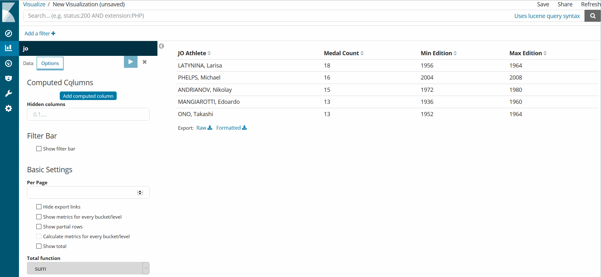

# Kibana Enhanced Table

This Kibana visualization plugin is like a Data Table, but with enhanced features like computed columns and filter bar.

## Features

- Add computed columns, based on other columns :
  - Support for [expr-eval](https://github.com/silentmatt/expr-eval#expression-syntax) expressions
  - Support for numeric columns (ex: `col0 + col1`)
  - Support for string columns, including HTML (ex: `col0 > 0 ? 'OK' : 'KO'`)
  - Ability to reference total hits count returned by ES query (ex: `col0 / total * 100`)
  - Support for numeric pretty format using [Numeral.js](http://numeraljs.com/#format) (ex: `0,0.00`)
  - Support for column alignment (ex: `left`, `right`)
  - Support for template rendering using [Handlebars](http://handlebarsjs.com/expressions.html) (ex: `<b>{{value}}</b>`)
  - Template can reference other columns using :`{{col0}}`
- Hide some table columns (ex: `0,1` hides columns 0 and 1)
- Add a filter bar (ex: `cat` filter will display only rows that contain "cat"). Works also with numeric and date columns.
- Hide export links (ex: when enabled, it will hide "Raw" and "Formatted" export links)
- Kibana supported versions : 5.5, 5.6, 6.0, 6.1 and 6.2

## Demo

## Install

Every release includes a Plugin version (X.Y.Z) and a Kibana version (A.B.C).

- Go to [releases](https://github.com/fbaligand/kibana-enhanced-table/releases "Go to releases!") and choose the right one for your Kibana
- launch a command shell and go to $KIBANA_HOME/bin folder
- use Kibana CLI to install : 
  - directly from Internet URL :
`$KIBANA_HOME/bin/kibana-plugin install https://github.com/fbaligand/kibana-enhanced-table/releases/download/vX.Y.Z/kibana-enhanced-table-X.Y.Z_A.B.C.zip`
  - locally after manual download :
`$KIBANA_HOME/bin/kibana-plugin install file:///path/to/kibana-enhanced-table-X.Y.Z_A.B.C.zip`

## Change Log

Versions and Release Notes are listed in [Releases](https://github.com/fbaligand/kibana-enhanced-table/releases) page

## Credits

This Kibana plugin is inspired from [computed-columns](https://github.com/seadiaz/computed-columns) and [kbn_searchtables](https://github.com/dlumbrer/kbn_searchtables) plugins.  
Thanks for their great work !

## Development

See the [kibana contributing guide](https://github.com/elastic/kibana/blob/master/CONTRIBUTING.md) for instructions setting up your development environment. Once you have completed that, use the following npm tasks.

  - `npm start`

    Start kibana and have it include this plugin

  - `npm start -- --config kibana.yml`

    You can pass any argument that you would normally send to `bin/kibana` by putting them after `--` when running `npm start`

  - `npm run build`

    Build a distributable archive

  - `npm run test:browser`

    Run the browser tests in a real web browser

  - `npm run test:server`

    Run the server tests using mocha

For more information about any of these commands run `npm run ${task} -- --help`.
